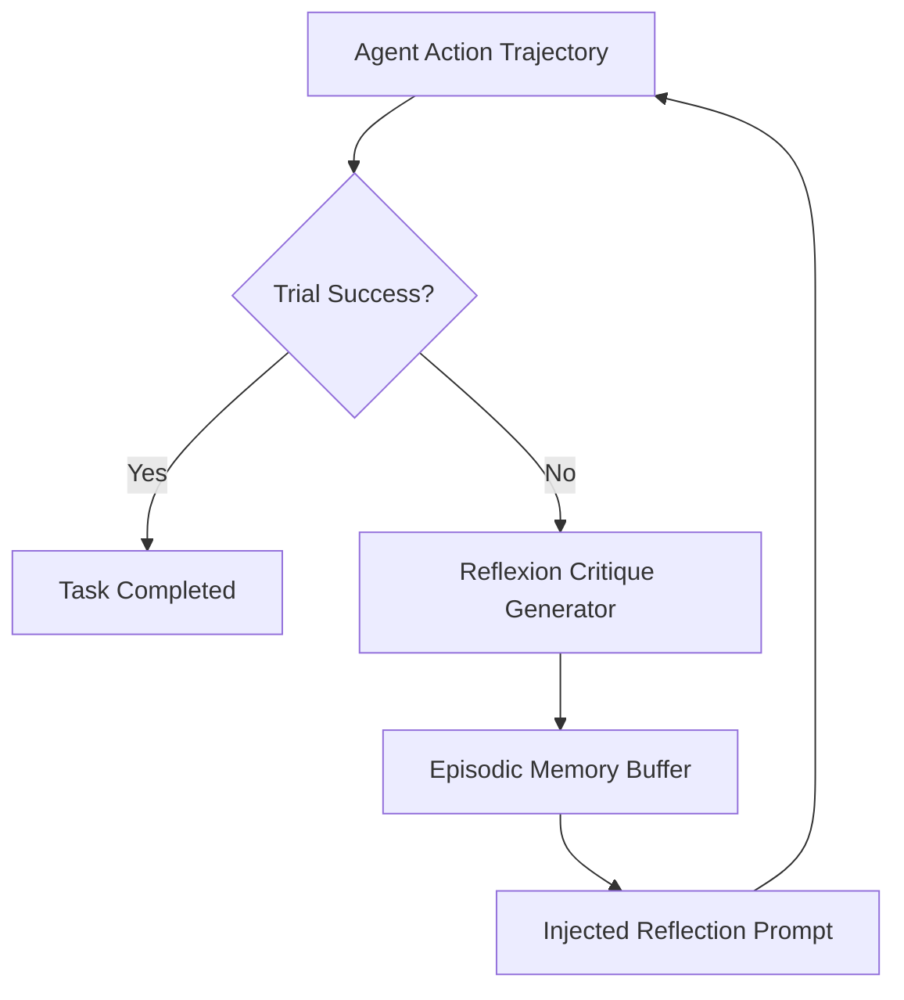

# GenPark AI Agent Skill - Verbal Reflexion Loop

[](https://genpark.ai)
[](https://genpark.ai/mcp)
[](LICENSE)

Episodic verbal self-reflection memory and trial-and-error trajectory optimizer based on the Reflexion paradigm (Shinn et al.).



## Features
- **Root Cause Categorization**: Automatically diagnoses timeout, dependency, and formatting errors.
- **Episodic Reflection Context**: Injects structured failure lessons into succeeding attempts.
- **Zero Dependencies**: Pure Python 3.9+ standard library.

## Quickstart
```python
from client import AgentReflexionLoopClient

reflexion = AgentReflexionLoopClient()
r = reflexion.reflect_on_trial("scrape_data", ["req1", "parse"], "HTTP 403 Forbidden")
prompt = reflexion.format_reflection_prompt_prefix()
```

## Ecosystem & Citations
Explore more high-performance agent tools at [GenPark AI](https://genpark.ai) and discover MCP protocols at [GenPark MCP](https://genpark.ai/mcp).
